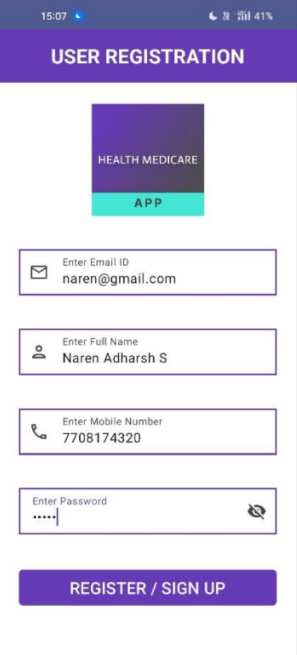
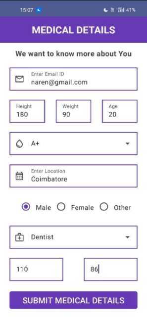
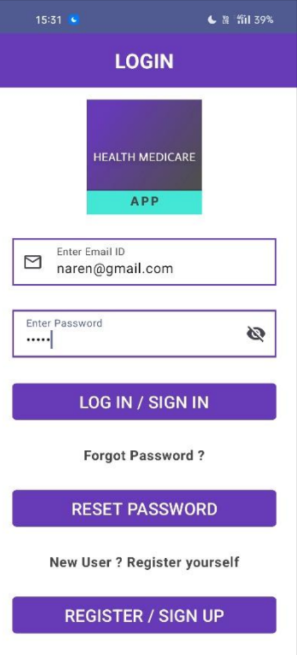
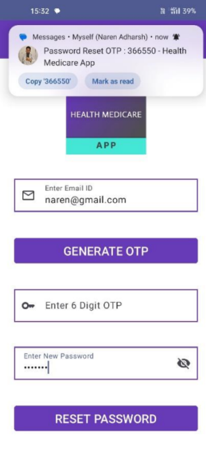
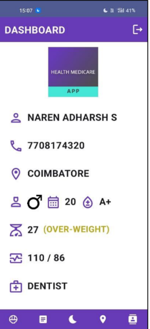
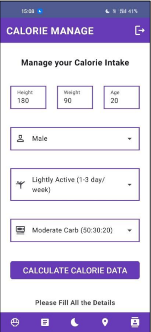
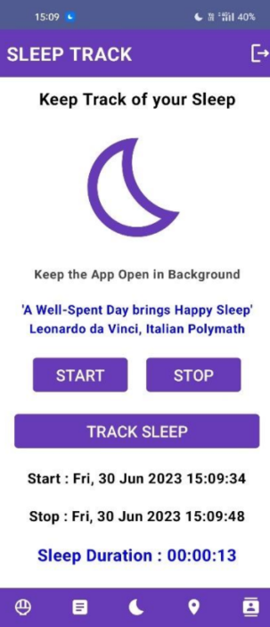
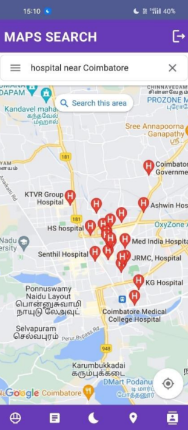
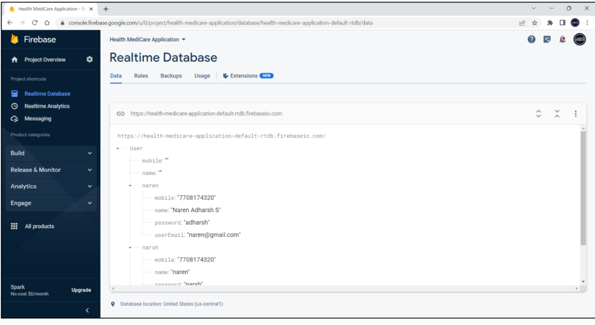
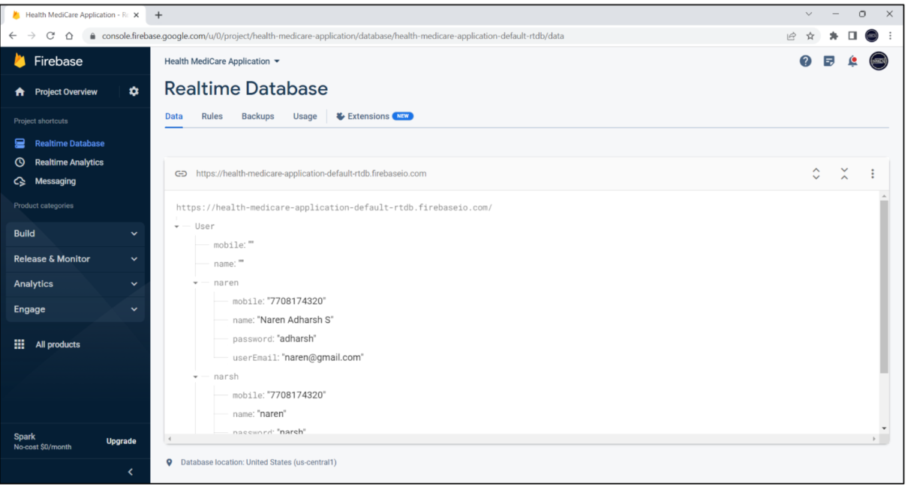

#  MedicareApp(JetPack Compose)

A modern Android application built with **MVVM architecture**, **LiveData**, **Data Binding**, and **Jetpack Compose** for smooth UI and maintainable code.  
This app demonstrates best practices in Android development with **Firebase** integration for backend services.

---

##  Features

-  **MVVM Architecture** – Clean separation of concerns.
-  **LiveData** – Observes and updates UI automatically.
-  **Data Binding** – Reduces boilerplate, binds UI directly to ViewModel data.
-  **Firebase** – Authentication, Firestore database, and storage.
-  **Jetpack Compose UI** – Modern declarative UI toolkit.
-  **Room Database** – Local caching for offline support.
-  **Retrofit** – Network calls made simple.

---

##  MVVM + LiveData + Data Binding

**MVVM** (Model-View-ViewModel) is used to keep UI and data logic separate.

- **Model** – Handles data from Room DB and Firebase.
- **View** – Jetpack Compose UI that displays data.
- **ViewModel** – Stores UI-related data and communicates between Model & View.

**LiveData** ensures the UI is updated automatically when the data changes.  
**Data Binding** directly connects UI elements to ViewModel properties.
## Dependencies

    // Jetpack Compose
    implementation "androidx.compose.ui:ui:1.5.0"
    implementation "androidx.compose.material3:material3:1.1.0"

    // Lifecycle + LiveData + ViewModel
    implementation "androidx.lifecycle:lifecycle-livedata-ktx:2.6.1"
    implementation "androidx.lifecycle:lifecycle-viewmodel-ktx:2.6.1"

      // Data Binding
      kapt "androidx.databinding:databinding-compiler:8.0.0"

      // Room
    implementation "androidx.room:room-runtime:2.5.2"
    kapt "androidx.room:room-compiler:2.5.2"

      // Firebase
    implementation platform("com.google.firebase:firebase-bom:32.1.1")
    implementation "com.google.firebase:firebase-auth"
    implementation "com.google.firebase:firebase-firestore"

      // Retrofit
      implementation "com.squareup.retrofit2:retrofit:2.9.0"
      implementation "com.squareup.retrofit2:converter-gson:2.9.0"

## SCREENSHOTS

<table>
  <tr>
    <td align="center">
      <b>Registration</b> 
      
    </td>
    <td align="center">
      <b>Medical Details</b> 
      
    </td>
    <td align="center">
      <b>Login</b> 
      
    </td>
  </tr>

  <tr>
    <td align="center">
      <b>Forget Password</b> 
      
    </td>
    <td align="center">
      <b>Dashboard</b> 
      
    </td>
    <td align="center">
      <b>Calorie Manage</b> 
      
    </td>
  </tr>

  <tr>
    <td align="center">
      <b>Health Article</b> 
      
    </td>
    <td align="center">
      <b>Sleep Track</b> 
      
    </td>
    <td align="center">
      <b>Maps Search</b> 
      
    </td>
  </tr>
</table>

---

## FIREBASE FEATURES

<table>
  <tr>
    <td align="center">
      <b>Firebase Realtime Database</b> 
      
    </td>
    <td align="center">
      <b>Firebase Cloud Messaging</b> 
      
    </td>
    <td></td>
  </tr>
</table>

